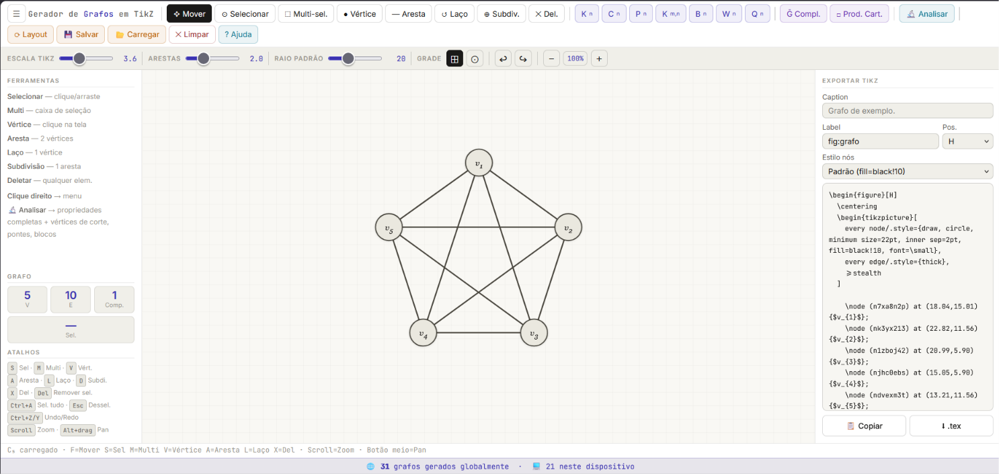

<div align="center">

<!-- Banner SVG inline — substitua por uma imagem real após tirar os prints -->


# Gerador de Grafos em TikZ

**Editor visual de grafos com exportação automática de código TikZ para LaTeX**

[](LICENSE)
[](index.html)
[](index.html)
[](https://grafoslatex.netlify.app)

[](https://grafoslatex.netlify.app)
[](https://www.ufabc.edu.br)

[**🚀 Acesse a ferramenta**](https://grafoslatex.netlify.app) · [**📖 Documentação**](docs/) · [**🐛 Reportar bug**](https://github.com/welbertfilho9/grafos-tikz/issues) · [**💡 Sugerir funcionalidade**](https://github.com/welbertfilho9/grafos-tikz/issues/new?template=feature_request.md)

</div>

---

## 📋 Índice

- [Sobre o projeto](#-sobre-o-projeto)
- [Motivação](#-motivação)
- [Demonstração](#-demonstração)
- [Funcionalidades](#-funcionalidades)
- [Tecnologias](#-tecnologias)
- [Como executar localmente](#-como-executar-localmente)
- [Arquitetura](#-arquitetura)
- [Exemplos de uso](#-exemplos-de-uso)
- [Roadmap](#-roadmap)
- [Como contribuir](#-como-contribuir)
- [FAQ](#-faq)
- [Licença](#-licença)
- [Contato](#-contato)

---

## 🎯 Sobre o projeto

O **Gerador de Grafos em TikZ** é uma aplicação web que permite desenhar grafos interativamente no navegador e exportar automaticamente o código **TikZ** correspondente, pronto para ser colado no **Overleaf** ou em qualquer documento LaTeX.

O projeto é uma aplicação de página única (**SPA**) construída com **HTML, CSS e JavaScript puros** — sem frameworks, sem instalação, sem dependências. Basta abrir o arquivo no navegador.

### O que você consegue fazer

```
Desenhar grafos visualmente  →  Exportar código TikZ  →  Colar no Overleaf
```

---

## 💡 Motivação

Este projeto nasceu durante minha pesquisa em **Teoria Topológica de Grafos** na [Universidade Federal do ABC (UFABC)](https://www.ufabc.edu.br).

Durante o projeto, precisei produzir centenas de figuras de grafos em TikZ para o documento LaTeX. O processo manual era:

1. Calcular coordenadas dos vértices manualmente
2. Escrever `\node`, `\draw` e `\path` um a um
3. Compilar o LaTeX para ver o resultado
4. Voltar ao código e corrigir posições

Esse ciclo levava **10 a 30 minutos por figura simples**. Para grafos com vértices de corte, pontes, laços ou arestas múltiplas — essenciais em Teoria Topológica — era ainda mais trabalhoso.

A ferramenta reduziu esse tempo para **menos de 1 minuto** por figura.

> *"Comecei a desenvolver para resolver meu próprio problema. Percebi que qualquer estudante ou pesquisador de teoria dos grafos, álgebra, combinatória ou topologia poderia se beneficiar."*

---

## 🎬 Demonstração

> 📸 **Screenshots e GIFs serão adicionados após captura — veja a [lista de assets pendentes](docs/assets/TODO-assets.md)**

<!-- Substitua pelos GIFs reais após gravar -->

| Funcionalidade | Demonstração |
|---|---|
| Gerar K₅ e exportar TikZ |  |
| Ferramenta Mover + Zoom |  |
| Análise: pontes e cortes |  |
| Subdivisão de arestas |  |

> 📸 *GIFs serão adicionados em breve. [Veja o site ao vivo →](https://grafoslatex.netlify.app)*

---

## ✨ Funcionalidades

### Ferramentas de edição

| Ferramenta | Atalho | Descrição |
|---|---|---|
| ✥ Mover | `F` | Pan do canvas; clique num objeto para selecioná-lo |
| ⊙ Selecionar | `S` | Seleciona e edita propriedades no painel lateral |
| ⬚ Multi-seleção | `M` | Arraste para caixa de seleção; mova, alinhe, delete vários |
| ● Vértice | `V` | Clique no canvas para adicionar |
| — Aresta | `A` | Clique em dois vértices para conectar |
| ↺ Laço | `L` | Cria laço (loop) em um vértice |
| ⊕ Subdivisão | `D` | Insere vértice de grau 2 no meio de uma aresta |
| ✕ Deletar | `X` | Remove vértice ou aresta |

### Geradores automáticos

| Gerador | Descrição |
|---|---|
| **Kₙ** | Grafo completo com n vértices |
| **Cₙ** | Ciclo com n vértices |
| **Pₙ** | Caminho com n vértices |
| **Kₘ,ₙ** | Grafo bipartido completo |
| **Bₙ** | Buquê de n círculos (topológico) |
| **Wₙ** | Roda (Wheel graph) |
| **Qₙ** | Hipercubo n-dimensional |
| **Ḡ** | Complemento do grafo atual |
| **G□H** | Produto cartesiano de grafos |

### Análise de grafos (🔬)

Clique em **Analisar** para calcular e destacar visualmente:

- **Vértices de corte** — destacados em vermelho (algoritmo de Tarjan)
- **Pontes / bridges** — destacadas em laranja
- **Blocos biconexos** — cada bloco em cor distinta
- **Propriedades:** Euleriano, Semi-euleriano, Bipartido, Regular, Conexo
- **Métricas:** Δ (grau máx), δ (grau mín), grau médio, sequência de graus, diâmetro, raio, componentes conexas

### Exportação TikZ

- Código gerado em **tempo real** enquanto você edita
- Encapsulado em `\begin{figure}[H]...\end{figure}`
- Suporte a `\caption{}` e `\label{}` definidos pelo usuário
- Estilos de nós: padrão, preenchido, branco, mínimo, ponto
- Cores exportadas como `\definecolor{}{RGB}{}`
- Controle de escala da figura
- Download direto como `.tex`

### Outras funcionalidades

- **Undo/Redo** ilimitado (`Ctrl+Z` / `Ctrl+Y`)
- **Auto-layout** force-directed (`Ctrl+L`)
- **Zoom** com scroll do mouse; reset com clique no percentual
- **Grade** com snap opcional
- **Salvar/Carregar** em `.json`
- **Menu de contexto** (clique direito) em qualquer elemento
- **Alinhamento e distribuição** de múltiplos vértices
- Suporte completo a **laços e arestas múltiplas** (grafos topológicos)

---

## 🛠 Tecnologias

| Camada | Tecnologia | Motivo da escolha |
|---|---|---|
| Interface | HTML5 + CSS3 | Zero dependências, portabilidade total |
| Lógica | JavaScript ES2020 (Vanilla) | Sem framework = sem build step = qualquer um executa |
| Gráficos | SVG nativo | Resolução infinita, manipulação via DOM |
| Deploy | Netlify (gratuito) | CI/CD, functions serverless, domínio grátis |
| Contador | Netlify Functions + counterapi.dev | Sem banco de dados, sem backend próprio |
| Analytics | Google Analytics 4 | Métricas de uso (configurável) |
| Fontes | Google Fonts (Inter + JetBrains Mono) | UX profissional |

> ⚠️ **Compatibilidade:** a ferramenta é otimizada para uso em **desktop** (teclado + mouse). Em dispositivos móveis a experiência é limitada.

**Por que sem framework?**

A decisão de não usar React, Vue ou Svelte foi intencional:
- Qualquer pessoa abre o `.html` e funciona — sem `npm install`, sem Node.js, sem terminal
- Estudantes e pesquisadores sem experiência em desenvolvimento conseguem usar e modificar
- O arquivo único pode ser enviado por e-mail, salvo no pen drive, hospedado em qualquer lugar

---

## 🚀 Como executar localmente

### Opção 1 — Direto no navegador (mais simples)

```bash
# Clone o repositório
git clone https://github.com/welbertfilho9/grafos-tikz.git

# Abra o arquivo
open grafos-tikz/index.html          # macOS
xdg-open grafos-tikz/index.html      # Linux
start grafos-tikz/index.html         # Windows
```

Ou simplesmente **arraste o `index.html` para o navegador**. Não precisa de servidor.

### Opção 2 — Com servidor local (para desenvolver)

```bash
# Python (já vem instalado na maioria dos sistemas)
cd grafos-tikz
python3 -m http.server 8080
# Abra: http://localhost:8080

# Node.js
npx serve .
# Abra: http://localhost:3000
```

### Opção 3 — Deploy próprio no Netlify

```bash
git clone https://github.com/welbertfilho9/grafos-tikz.git
# Arraste a pasta no painel do Netlify em app.netlify.com
# Ou conecte o repositório para deploy automático no push
```

> **Nota:** O contador global de grafos gerados requer a Netlify Function (`netlify/functions/counter.mjs`). Para funcionar no deploy próprio, conecte o repositório ao Netlify via Git (não por arrastar pasta) — veja [docs/deploy.md](docs/deploy.md).

---

## 🏗 Arquitetura

```
┌─────────────────────────────────────────────────────┐
│                    index.html                        │
│                                                      │
│  ┌──────────┐   ┌──────────┐   ┌─────────────────┐ │
│  │  Canvas   │   │ Sidebar  │   │   TikZ Panel    │ │
│  │  (SVG)    │   │(Props)   │   │  (Export)       │ │
│  └─────┬─────┘   └────┬─────┘   └────────┬────────┘ │
│        │              │                   │          │
│  ┌─────▼──────────────▼───────────────────▼────────┐ │
│  │              Estado Global                       │ │
│  │  verts[] · edges[] · tool · selected · history[] │ │
│  └─────┬──────────────────────────────────┬─────────┘ │
│        │                                  │          │
│  ┌─────▼──────┐                  ┌────────▼────────┐ │
│  │  Renderer  │                  │  TikZ Exporter  │ │
│  │ renderAll()│                  │ generateTikz()  │ │
│  │ SVG paths  │                  │ toTikz(x,y)     │ │
│  └────────────┘                  └─────────────────┘ │
└─────────────────────────────────────────────────────┘
         │
         ▼
┌────────────────────┐
│  Netlify Function  │
│  /api/counter      │
│  (Node 18, fetch)  │
└────────────────────┘
```

Para a documentação completa da arquitetura, veja [docs/architecture.md](docs/architecture.md).

---

## 📁 Estrutura do repositório

```
grafos-tikz/
│
├── index.html                  # Aplicação completa (SPA)
├── netlify.toml                # Configuração de deploy
├── README.md                   # Este arquivo
├── LICENSE                     # MIT License
├── CONTRIBUTING.md             # Guia de contribuição
├── CHANGELOG.md                # Histórico de versões
├── CODE_OF_CONDUCT.md          # Código de conduta
│
├── netlify/
│   └── functions/
│       └── counter.mjs         # Serverless function (contador global)
│
├── docs/
│   ├── architecture.md         # Arquitetura detalhada
│   ├── user-guide.md           # Guia do usuário
│   ├── developer-guide.md      # Guia do desenvolvedor
│   ├── deploy.md               # Guia de deploy
│   ├── faq.md                  # Perguntas frequentes
│   ├── tutorial.md             # Tutorial passo a passo
│   └── assets/                 # Screenshots e GIFs
│
├── examples/
│   ├── README.md               # Índice dos exemplos
│   ├── complete-graphs/        # K3, K4, K5, K6
│   ├── cycles/                 # C3, C4, C5, C6
│   ├── paths/                  # P2 a P8
│   ├── bipartite/              # K2,3 K3,3 K2,2
│   ├── topological/            # Buquês, laços, multigrafo
│   ├── wheels/                 # W3 a W6
│   └── subdivided/             # Grafos com subdivisão
│
└── .github/
    ├── ISSUE_TEMPLATE/
    │   ├── bug_report.md
    │   └── feature_request.md
    └── workflows/
        └── deploy.yml          # CI/CD automático
```

---

## 📚 Exemplos de uso

### Exemplo 1 — K₅ completo

Clique em **K_n** → insira `n = 5` → **Gerar**.

Código TikZ gerado:
```latex
\begin{figure}[H]
  \centering
  \begin{tikzpicture}[
    every node/.style={draw, circle, minimum size=22pt,
                       inner sep=2pt, fill=black!10, font=\small},
    every edge/.style={thick},
    >=stealth
  ]
    \node (n1) at (0.00,2.00) {$v_{1}$};
    \node (n2) at (1.90,0.62) {$v_{2}$};
    % ... demais vértices
    \draw (n1) -- (n2);
    % ... demais arestas
  \end{tikzpicture}
  \caption{Grafo completo $K_5$}
  \label{fig:k5}
\end{figure}
```

Veja a pasta [examples/](examples/) para arquivos `.json` prontos de dezenas de grafos.

---

## 🗺 Roadmap

### v1.1 — Em planejamento
- [ ] Exportação para outros formatos (GraphML, DOT/Graphviz, SVG)
- [ ] Temas de cores (dark mode)
- [ ] Histórico de grafos salvos localmente
- [ ] Suporte a rótulos matemáticos com renderização LaTeX (MathJax)

### v1.2 — Futuro
- [ ] Algoritmos visuais passo a passo (BFS, DFS, Dijkstra, Kruskal)
- [ ] Detecção e coloração de ciclos
- [ ] Isomorfismo: comparar dois grafos visualmente
- [ ] Modo colaborativo (dois usuários editando ao mesmo tempo)
- [ ] API pública para gerar código TikZ via POST

### v2.0 — Visão de longo prazo
- [ ] Suporte a hipergrafos
- [ ] Exportação para Asymptote e MetaPost
- [ ] Plugin para VSCode
- [ ] Integração com Overleaf via API

> Tem uma ideia? [Abra uma issue](https://github.com/welbertfilho9/grafos-tikz/issues/new?template=feature_request.md) com a tag `enhancement`.

---

## 🤝 Como contribuir

Contribuições são bem-vindas! Seja corrigindo um bug, melhorando a documentação ou implementando uma nova funcionalidade.

Leia o [CONTRIBUTING.md](CONTRIBUTING.md) para o guia completo. O resumo:

```bash
# 1. Fork o repositório e clone
git clone https://github.com/welbertfilho9/grafos-tikz.git

# 2. Crie uma branch descritiva
git checkout -b feature/exportacao-graphml

# 3. Faça suas alterações em index.html
# Teste abrindo no navegador — sem build necessário

# 4. Commit seguindo Conventional Commits
git commit -m "feat: adiciona exportação para formato GraphML"

# 5. Push e abra um Pull Request
git push origin feature/exportacao-graphml
```

### Áreas que precisam de contribuição

- 🌐 **Tradução** para inglês e espanhol
- 🧪 **Testes** (atualmente sem cobertura automatizada)
- 📱 **Mobile** — a ferramenta é otimizada para desktop; contribuições para adaptar a telas pequenas são bem-vindas
- ♿ **Acessibilidade** — navegação por teclado e leitores de tela
- 📖 **Documentação** — exemplos, tutoriais, vídeos

---

## ❓ FAQ

**O projeto precisa de internet para funcionar?**
Não. O `index.html` funciona completamente offline. A única funcionalidade que requer conexão é o contador global de grafos gerados.

**Posso usar em trabalhos acadêmicos?**
Sim. O projeto é MIT — use, modifique e distribua. Uma citação é bem-vinda mas não obrigatória.

**O código TikZ gerado compila no Overleaf sem configuração extra?**
Sim, para a maioria dos grafos. O cabeçalho gerado usa apenas `tikzpicture` padrão. Para laços e arestas curvas, certifique-se de ter `\usetikzlibrary{arrows.meta}` no preâmbulo.

**Posso adicionar meu próprio servidor de contagem?**
Sim. A variável `API` em `index.html` aponta para `/api/counter`. Basta trocar pelo endpoint da sua função.

**Por que não React/Vue/Svelte?**
Porque o objetivo é que qualquer pessoa abra o arquivo e use — sem Node.js, sem terminal, sem instalação. Veja [a seção de tecnologias](#-tecnologias).

Para mais perguntas, veja [docs/faq.md](docs/faq.md).

---

## 📊 Contador global

O badge acima mostra o número de grafos gerados por todos os usuários da ferramenta ao redor do mundo, atualizado em tempo real via [shields.io](https://shields.io) + API própria.

> **Para quem faz fork:** o contador continua apontando para a instância original. Se quiser seu próprio contador, atualize a variável `API` em `index.html` e faça deploy da function em `netlify/functions/counter.mjs` na sua conta do Netlify.

---

## 🤖 Nota sobre IA

Este projeto foi desenvolvido com apoio de ferramentas de inteligência artificial (Claude, da Anthropic) para auxiliar na implementação de partes do código JavaScript, na redação da documentação e na resolução de problemas técnicos.

Todas as decisões de projeto, validação de resultados, escolhas de arquitetura e publicação são de responsabilidade do autor. O código foi revisado, testado e compreendido antes de cada commit.

O uso de IA como ferramenta de desenvolvimento é análogo ao uso de Stack Overflow, documentação oficial ou qualquer outra referência técnica — acelera o processo sem substituir o julgamento humano.

---

## 🎓 Contexto acadêmico

Este projeto surgiu durante o desenvolvimento do projeto de pesquisa **"Introdução à Teoria Topológica de Grafos"** na Universidade Federal do ABC (UFABC), sob orientação do departamento de Matemática.

O projeto de iniciação científica envolveu o estudo de grafos topológicos, imersões em superfícies, o gênero de um grafo e o teorema dos quatro cores. A produção de figuras TikZ era parte essencial da documentação e, ao perceber o custo de tempo envolvido, o desenvolvimento desta ferramenta se tornou uma extensão natural do trabalho.

---

## 📄 Licença

Distribuído sob a licença MIT. Veja [LICENSE](LICENSE) para mais informações.

---

## 📬 Contato

**Welbert da Silva Freitas Filho** — pesquisador em Teoria Topológica de Grafos, UFABC

- GitHub: [@welbertfilho9](https://github.com/welbertfilho9)
- LinkedIn: [LinkedIn](https://www.linkedin.com/in/welbert-da-silva-freitas-filho-697075177)
- E-mail: `welbertfilho9@gmail.com`

🔗 **Site da ferramenta:** [grafoslatex.netlify.app](https://grafoslatex.netlify.app)

---

<div align="center">

Feito com ☕ durante uma pesquisa em Teoria dos Grafos na UFABC

⭐ **Se este projeto te ajudou, deixe uma estrela!** ⭐

</div>
